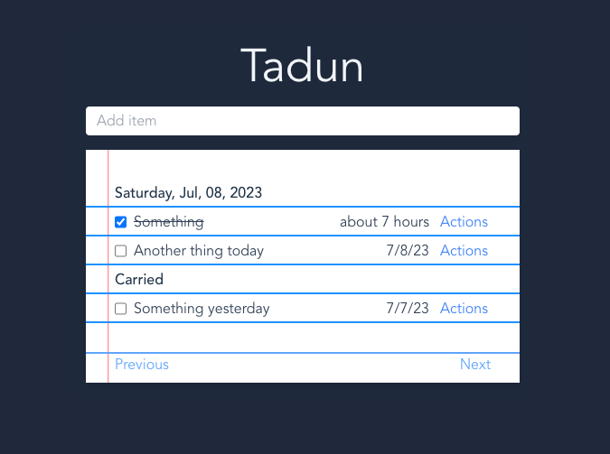

# Tadun

A simple to-do list app. Trying out a few technologies like Vite and Typescript while using the mobx state tree library with hot module reloading.

I might use this full time if the dog keeps tearing up my notebooks.

I'm also using this project to get more familiar with tailwind. I plan on styling my to-do list to look like a piece of paper out of a notebook.

## Nice to have features

[X] Saving list locally  
[X] Deleting todos  
[X] Ability to carry tasks over that were not finished on the previous day(s)  
[X] Ability to navigate between days  
[ ] Tagging items (Support tag)  
[ ] Drag and drop items to move them up and down the list
